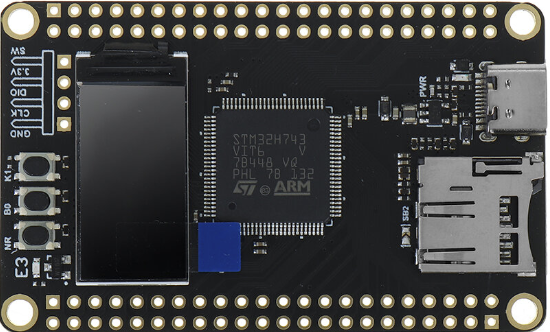
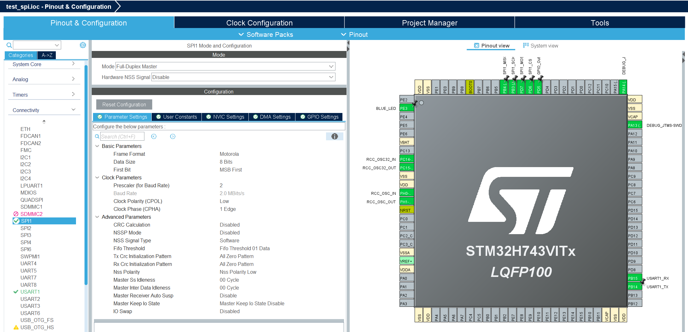
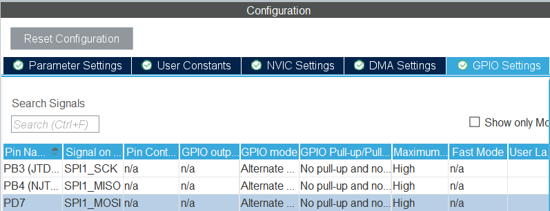
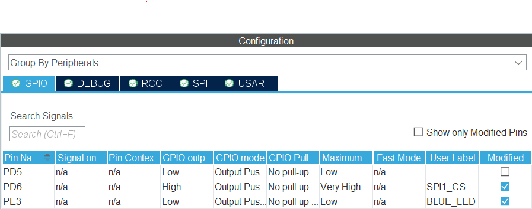
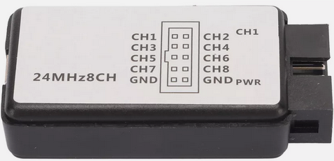

# STM32 LittleFS SPI Port

<p align="center">
  
</p>

This repository contains a simple Littefs port using the SPI interface on a **STM32H743** development board. It should be relative easy to port this to other STM32 processors as the interface is based on standard STM32 HAL calls.

**Littlefs** is a microcontroller file system well suited for Flash based devices, you can find all the source files [here](https://github.com/littlefs-project/littlefs). 

The demo design is written for a low-cost (£13 UK May24) **STM32H743VIT6** board I found on Aliexpress. If you don't need RF comms then these board are very good value as you get close to Teensy 4.x type of performance/spec for a fraction of the price.

The STM32 development environment is not as good (IMHO) as the Raspberry pico RP2040 SDK but it works and is easy to use. 

## Build the project

Copy the *core/inc/W25Qxx.h* and *core/src/W25Qxx.c* to the appropriate folder in your project. Next add the littlefs files *lfs.c/lfs.h* and *lfs_util.h*. Copy and paste the copy snippets from *mainx.c* into your main.c. The WeACT STM32Hxx board settings are shown below:


<p align="center">
  
  Figure: STMicroelectronics STM32CubeIDE free development tool 
</p>


Check all the pin settings for your board, on the WeACT board the Flash /CS pin (SPI1_CS) is connected to a general purpose output pin (PD7):

<p align="center">
  
</p>

If you want to use higher SPI clock values you might need to set the pins output speed to "very high".
<p align="center">
  
</p>

The BLUE_LED is connected to an LED on the WeACT board, PD5 is a testpin I forgot to remove.

## Output messages using printf

For output message I use printf redirected to the first UART, see mainx.c 

```C
/* USER CODE BEGIN PFP */
#define PUTCHAR_PROTOTYPE int __io_putchar(int ch)
/* USER CODE END PFP */

/* USER CODE BEGIN 4 */
PUTCHAR_PROTOTYPE
{
  /* Place your implementation of fputc here */
  /* e.g. write a character to the USART1 and Loop until the end of transmission */
  HAL_UART_Transmit(&huart1, (uint8_t *)&ch, 1, 0xFFFF);
  return ch;
}
/* USER CODE END 4 */
```

## LittleFS test

The test is modified from an Raspberry pico rp2040 example I found on the web. The test part displays some flash device info (device ID, SFDP table) before it runs a simple file read/write test. 
The read/write test consist of creating 32 files, renaming them and then deleting them again, after each stage the directory is displayed. The output (for a **W25Q64JV** device) should be something like (some lines removed to reduce the size):

```
littlefs version 20009
Flash Identifier = 0x00ef4017
64bits Identifier = 0xdf635c76c76b0929
StatusReg1=00
StatusReg2=02
StatusReg3=60

Read SFDP Table:
S F D P  05 01 00 ff 00 05 01 10 80 00 00 ff ff ff ff ff ff ff ff ff ff ff ff ff ff ff ff ff
ff ff ff ff ff ff ff ff ff ff ff ff ff ff ff ff ff ff ff ff ff ff ff ff ff ff ff ff ff ff ff 
ff ff ff ff ff ff ff ff ff ff ff ff ff ff ff ff ff ff ff ff ff ff ff ff ff ff ff ff ff ff ff 
ff ff ff ff ff ff ff ff ff ff ff ff ff ff ff ff ff ff ff ff ff ff ff ff ff ff ff ff ff ff ff 
ff ff ff e5 20 f9 ff ff ff ff 03 44 eb 08 6b 08 3b 42 bb fe ff ff ff ff ff 00 00 ff ff 40 eb 
0c 20 0f 52 10 d8 00 00 36 02 a6 00 82 ea 14 c4 e9 63 76 33 7a 75 7a 75 f7 a2 d5 5c 19 f7 4d 
ff e9 30 f8 80 ff ff ff ff ff ff ff ff ff ff ff ff ff ff ff ff ff ff ff ff ff ff ff ff ff ff 
ff ff ff ff ff ff ff ff ff ff ff ff ff ff ff ff ff ff ff ff ff ff ff ff ff ff ff ff ff ff ff 
ff ff ff ff ff ff ff

********************* Mount lfs ***********************

lfs_format - returned: 0
lfs_mount  - returned: 0
Write to File F0.tst
Write to File F1.tst
Write to File F2.tst
..
Write to File F29.tst
Write to File F30.tst
Write to File F31.tst
               .
              ..
          F0.tst  0007
          F1.tst  0007
         F10.tst  0008
         F11.tst  0008
         F12.tst  0008
         F13.tst  0008
         F14.tst  0008
         F15.tst  0008
         F16.tst  0008
         F17.tst  0008
         F18.tst  0008
         F19.tst  0008
          F2.tst  0007
         F20.tst  0008
         F21.tst  0008
         F22.tst  0008
         F23.tst  0008
         F24.tst  0008
         F25.tst  0008
         F26.tst  0008
         F27.tst  0008
         F28.tst  0008
         F29.tst  0008
          F3.tst  0007
         F30.tst  0008
         F31.tst  0008
          F4.tst  0007
          F5.tst  0007
          F6.tst  0007
          F7.tst  0007
          F8.tst  0007
          F9.tst  0007

Blocks 2048, block size 4096, used 2
FS: blocks 2048, block size 4096, used 2
Rename from F0.tst to R0.tst
Rename from F1.tst to R1.tst
Rename from F2.tst to R2.tst
..
Rename from F29.tst to R29.tst
Rename from F30.tst to R30.tst
Rename from F31.tst to R31.tst
               .
              ..
          R0.tst  0007
          R1.tst  0007
         R10.tst  0008
         R11.tst  0008
         R12.tst  0008
         R13.tst  0008
         R14.tst  0008
         R15.tst  0008
         R16.tst  0008
         R17.tst  0008
         R18.tst  0008
         R19.tst  0008
          R2.tst  0007
         R20.tst  0008
         R21.tst  0008
         R22.tst  0008
         R23.tst  0008
         R24.tst  0008
         R25.tst  0008
         R26.tst  0008
         R27.tst  0008
         R28.tst  0008
         R29.tst  0008
          R3.tst  0007
         R30.tst  0008
         R31.tst  0008
          R4.tst  0007
          R5.tst  0007
          R6.tst  0007
          R7.tst  0007
          R8.tst  0007
          R9.tst  0007

Blocks 2048, block size 4096, used 2
FS: blocks 2048, block size 4096, used 2
Reopen Filename=R0.tst
File R0.tst removed
Reopen Filename=R1.tst
File R1.tst removed
Reopen Filename=R2.tst
..
File R29.tst removed
Reopen Filename=R30.tst
File R30.tst removed
Reopen Filename=R31.tst
File R31.tst removed
               .
              ..

Blocks 2048, block size 4096, used 2
FS: blocks 2048, block size 4096, used 2
lfs test done
```


### Debugging

If the port is not working then I would recommend the following:

1) Check the /WP and /Hold pins of your SPI flash are tied to Vcc.
2) Check you are using the right pin for /CS, the default value should be high.
3) Check the SPI clock frequency, if you are using flying wires you need to lower the clock. This is very easy to do in the Clock Configuration page of the free [STM32CubeIDE/STM32CubeMX](https://www.st.com/en/development-tools/stm32cubeide.html).
4) Try your SPI interface without littlefs, simple write/read-back a pattern, check erase clears the sector(4096 bytes) to all 0xFF.
5) Comment out SPIDEBUG define in W25Qxx.h, this should print a message for each read/write/erase request.
6) Comment out LFS_YES_TRACE define in lfs_util.h, this will print littlefs debugging messages.
7) Add a readback to the stmlfs_hal_prog routines and check the page is written correctly.
8) Buy tiny USB based logic analyzer, these are very useful in debugging SPI/I2C issues and cost hardly any money (less than £10 UK).


<p align="center">
  
</p>


## Enhancements

The port is very slow as it only uses a single DI/DO pin for communication, QSPI uses 4 wires but require modification of the code. The interface will stall the CPU until the Flash is done (Busy pin goes low). A better solution is to DMA the data to the SPI interface and to use an interrupt to indicate the read/write/erase is done. 

## License

See the LICENSE file for details.


## Trademarks

STM32 is a registered trademark of STMicroelectronics International N.V.
